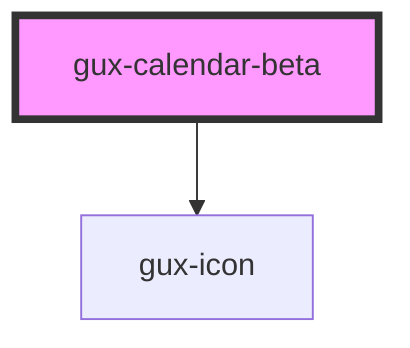

# gux-calendar-beta

<!-- Auto Generated Below -->

## Events

| Event   | Description                        | Type                  |
| ------- | ---------------------------------- | --------------------- |
| `input` | Triggered when user selects a date | `CustomEvent<string>` |

## Dependencies

### Depends on

- [gux-icon](../../../../stable/gux-icon)

### Graph

----------------------------------------------

*Built with [StencilJS](https://stenciljs.com/)*
