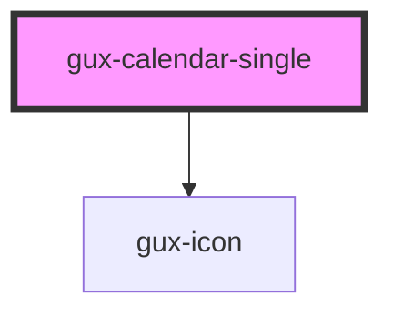

# gux-calendar-beta

<!-- Auto Generated Below -->

## Methods

### `focusSelectedDate() => Promise<void>`

#### Returns

Type: `Promise<void>`

## Dependencies

### Depends on

- [gux-icon](../../stable/gux-icon)

### Graph

----------------------------------------------

*Built with [StencilJS](https://stenciljs.com/)*
