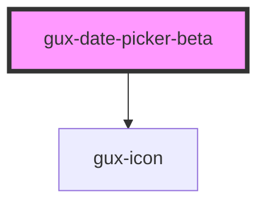

# gux-date-picker-beta

<!-- Auto Generated Below -->

## Properties

| Property         | Attribute           | Description                                                                                                   | Type                                   | Default     |
| ---------------- | ------------------- | ------------------------------------------------------------------------------------------------------------- | -------------------------------------- | ----------- |
| `maxDate`        | `max-date`          | The max date selectable                                                                                       | `string`                               | `''`        |
| `minDate`        | `min-date`          | The min date selectable                                                                                       | `string`                               | `''`        |
| `numberOfMonths` | `number-of-months`  | The calendar number of months displayed                                                                       | `number`                               | `1`         |
| `startDayOfWeek` | `start-day-of-week` | The day of the week to start each calendar row. ISO weekday number ie 1 - Monday, 2 - Tuesday, ... 7 - Sunday | `0 \| 1 \| 2 \| 3 \| 4 \| 5 \| 6 \| 7` | `undefined` |
| `value`          | `value`             | The calendar current selected date                                                                            | `string`                               | `''`        |

## Events

| Event   | Description                        | Type                  |
| ------- | ---------------------------------- | --------------------- |
| `input` | Triggered when user selects a date | `CustomEvent<string>` |

## Methods

### `focusPreviewDate() => Promise<void>`

Focus the preview date

#### Returns

Type: `Promise<void>`

### `resetCalendarView(value: Date) => Promise<void>`

Reset calendar view to show first selected date

#### Returns

Type: `Promise<void>`

## Dependencies

### Depends on

- [gux-icon](../../stable/gux-icon)

### Graph

----------------------------------------------

*Built with [StencilJS](https://stenciljs.com/)*
