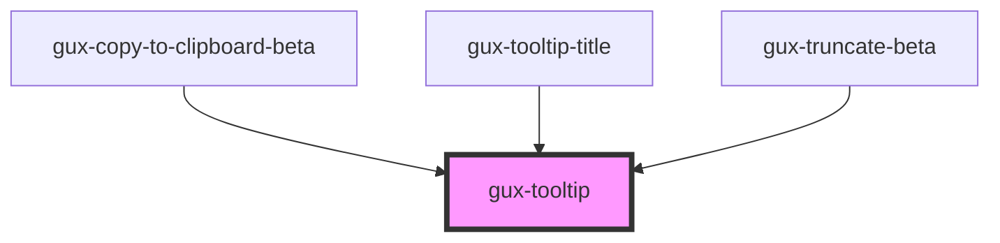

# gux-tooltip

This custom component is a simple tooltip.

When hovering a node, the tooltip will be shown below.

If there is not enough space on the bottom, or right of the component, the tooltip position will be adjusted.

## Example usage

``` html
<!-- First option (With parentElement) -->
<div>
  <button>Button</button>
  <gux-tooltip>My great tooltip</gux-tooltip>
</div>

<!-- Second option (With parent id in for attribute) -->
<button id="needs-tooltip">Button</button>
<gux-tooltip for="needs-tooltip">My great tooltip</gux-tooltip>
```

<!-- Auto Generated Below -->


## Properties

| Property    | Attribute    | Description                                                                                                | Type                                                                                                                                                                 | Default          |
| ----------- | ------------ | ---------------------------------------------------------------------------------------------------------- | -------------------------------------------------------------------------------------------------------------------------------------------------------------------- | ---------------- |
| `contrast`  | `contrast`   |                                                                                                            | `"dark" \| "light"`                                                                                                                                                  | `'light'`        |
| `for`       | `for`        | Indicates the id of the element the popover should anchor to. (If not supplied the parent element is used) | `string`                                                                                                                                                             | `undefined`      |
| `hasAnchor` | `has-anchor` |                                                                                                            | `boolean`                                                                                                                                                            | `false`          |
| `placement` | `placement`  | Placement of the tooltip. Default is bottom-start                                                          | `"bottom" \| "bottom-end" \| "bottom-start" \| "left" \| "left-end" \| "left-start" \| "right" \| "right-end" \| "right-start" \| "top" \| "top-end" \| "top-start"` | `'bottom-start'` |


## Methods

### `hideTooltip() => Promise<void>`


#### Returns

Type: `Promise<void>`


### `showTooltip() => Promise<void>`


#### Returns

Type: `Promise<void>`


## Slots

| Slot | Description            |
| ---- | ---------------------- |
|      | Content of the tooltip |


## CSS Custom Properties

| Name                                      | Description |
| ----------------------------------------- | ----------- |
| `--gse-body-sm-regular-font-family`       |             |
| `--gse-body-sm-regular-font-size`         |             |
| `--gse-body-sm-regular-font-weight`       |             |
| `--gse-body-sm-regular-letter-spacing`    |             |
| `--gse-body-sm-regular-line-height`       |             |
| `--gse-body-sm-regular-paragraph-indent`  |             |
| `--gse-body-sm-regular-paragraph-spacing` |             |
| `--gse-body-sm-regular-text-case`         |             |
| `--gse-body-sm-regular-text-decoration`   |             |
| `--gse-elevation-medium-20-blur`          |             |
| `--gse-elevation-medium-20-color`         |             |
| `--gse-elevation-medium-20-type`          |             |
| `--gse-elevation-medium-20-x`             |             |
| `--gse-elevation-medium-20-y`             |             |
| `--gse-ui-tooltip-background-dark`        |             |
| `--gse-ui-tooltip-background-default`     |             |
| `--gse-ui-tooltip-border-default`         |             |
| `--gse-ui-tooltip-foreground-default`     |             |
| `--gse-ui-tooltip-foreground-inverse`     |             |
| `--gux-zindex-tooltip`                    |             |


## Dependencies

### Used by

 - [gux-copy-to-clipboard-beta](../../beta/gux-copy-to-clipboard)
 - [gux-tooltip-title](../gux-tooltip-title)
 - [gux-truncate-beta](../../beta/gux-truncate)

### Graph


----------------------------------------------

*Built with [StencilJS](https://stenciljs.com/)*
